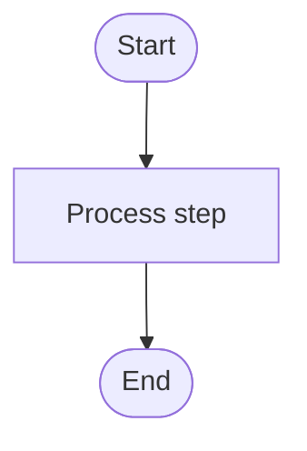

# 🚀 Simple Startup Guide

**Having trouble getting started? Follow these steps!**

---

## ⚡ Super Quick Start (5 Minutes)

### Step 1: Clone the Repository

```bash
git clone https://github.com/Aren-Garro/Flowcharts.git
cd Flowcharts
```

### Step 2: Install Python Dependencies

**Windows PowerShell:**
```powershell
# Make sure you're in the Flowcharts directory
python -m pip install -r requirements.txt
```

**Mac/Linux:**
```bash
pip3 install -r requirements.txt
```

### Step 3: Try It Out!

```bash
# Generate your first flowchart
python -m cli.main generate examples/simple_workflow.txt -o my_first_chart.mmd

# View the output
cat my_first_chart.mmd  # Mac/Linux
type my_first_chart.mmd # Windows
```

**That's it!** You should see Mermaid code output.

---

## 🔧 Common Startup Problems & Solutions

### Problem 1: "Python not found" or "python is not recognized"

**Solution:**

1. **Check if Python is installed:**
   ```bash
   python --version
   # OR
   python3 --version
   ```

2. **If not installed:**
   - **Windows:** Download from [python.org](https://www.python.org/downloads/) (Get Python 3.9+)
   - **Mac:** `brew install python3`
   - **Linux:** `sudo apt install python3 python3-pip`

3. **After installing, use:**
   - Windows: `python -m cli.main ...`
   - Mac/Linux: `python3 -m cli.main ...`

---

### Problem 2: "No module named 'cli'" or "No module named 'src'"

**Solution:**

1. **Make sure you're in the right directory:**
   ```bash
   pwd  # Mac/Linux
   cd   # Windows
   
   # You should see: .../Flowcharts
   # If not, run:
   cd path/to/Flowcharts
   ```

2. **Install dependencies:**
   ```bash
   pip install -r requirements.txt
   ```

3. **Try again:**
   ```bash
   python -m cli.main generate examples/simple_workflow.txt -o test.mmd
   ```

---

### Problem 3: "No module named 'pydantic'" (or other module)

**Solution:**

```bash
# Install all required packages
pip install -r requirements.txt

# If that doesn't work, install individually:
pip install pydantic
pip install spacy
pip install click
```

---

### Problem 4: "Permission denied" or "Access is denied"

**Solution:**

**Windows:**
```powershell
# Run as administrator OR use:
pip install --user -r requirements.txt
```

**Mac/Linux:**
```bash
# Use pip3 instead of pip
pip3 install -r requirements.txt

# OR use --user flag
pip install --user -r requirements.txt
```

---

### Problem 5: Virtual Environment Issues

**Don't worry about virtual environments for now!**

Just install directly:

```bash
# Windows
python -m pip install -r requirements.txt

# Mac/Linux
pip3 install -r requirements.txt
```

**If you want to use a virtual environment (optional):**

```bash
# Create venv
python -m venv venv

# Activate it
# Windows PowerShell:
venv\Scripts\activate
# Windows CMD:
venv\Scripts\activate.bat
# Mac/Linux:
source venv/bin/activate

# Install
pip install -r requirements.txt
```

---

### Problem 6: "Can't find examples/simple_workflow.txt"

**Solution:**

1. **Check if file exists:**
   ```bash
   ls examples/  # Mac/Linux
   dir examples\ # Windows
   ```

2. **If examples directory is missing, create your own test file:**
   ```bash
   # Create test.txt with this content:
   echo "1. Start process
2. Get user input
3. Validate data
4. Check if valid
   - If yes: Save to database
   - If no: Show error
5. End" > test.txt
   
   # Then run:
   python -m cli.main generate test.txt -o output.mmd
   ```

---

### Problem 7: spaCy Model Errors

**Solution:**

```bash
# Install the spaCy language model
python -m spacy download en_core_web_sm

# OR if that fails, the tool will work WITHOUT spaCy
# (it has a fallback parser)
```

---

## 📋 Step-by-Step First Run

### On Windows (PowerShell)

```powershell
# 1. Navigate to the project
cd C:\path\to\Flowcharts

# 2. Install dependencies
python -m pip install -r requirements.txt

# 3. Create a simple workflow file
@"
1. Start
2. Process data
3. End
"@ | Out-File -FilePath workflow.txt -Encoding utf8

# 4. Generate flowchart
python -m cli.main generate workflow.txt -o output.mmd

# 5. View output
type output.mmd
```

### On Mac/Linux (Terminal)

```bash
# 1. Navigate to the project
cd ~/path/to/Flowcharts

# 2. Install dependencies
pip3 install -r requirements.txt

# 3. Create a simple workflow file
cat > workflow.txt << 'EOF'
1. Start
2. Process data
3. End
EOF

# 4. Generate flowchart
python3 -m cli.main generate workflow.txt -o output.mmd

# 5. View output
cat output.mmd
```

---

## ✅ Verify Installation

**Run this to check everything:**

```bash
python validate_code.py
```

You should see:
```
✓ All Python files are valid
✓ All imports are correct
✓ No syntax errors
```

---

## 🎯 Minimal Working Example

**Just want to see if it works? Run this:**

```bash
# Install
pip install pydantic click spacy

# Create simple input
echo "1. Start
2. End" > simple.txt

# Run
python -m cli.main generate simple.txt -o simple.mmd

# Check output
cat simple.mmd  # Mac/Linux
type simple.mmd # Windows
```

**Expected output:**


---

## 🖼️ Want PNG/SVG Images? (Optional)

**The basic tool generates `.mmd` files (Mermaid code).**

To get PNG/SVG images, you need `mermaid-cli`:

```bash
# 1. Install Node.js from https://nodejs.org/

# 2. Install mermaid-cli
npm install -g @mermaid-js/mermaid-cli

# 3. Now you can generate images:
python -m cli.main generate workflow.txt -o chart.png
python -m cli.main generate workflow.txt -o chart.svg
python -m cli.main generate workflow.txt -o chart.pdf
```

**Don't have Node.js? No problem!**
- Use the `.mmd` output with [Mermaid Live Editor](https://mermaid.live/)
- Or use `.html` output: `python -m cli.main generate workflow.txt -o chart.html`

---

## 🆘 Still Having Issues?

### Quick Diagnostics

1. **Check Python version:**
   ```bash
   python --version
   # Should be 3.9 or higher
   ```

2. **Check if you're in the right directory:**
   ```bash
   ls -la  # Mac/Linux
   dir     # Windows
   
   # You should see:
   # - cli/ folder
   # - src/ folder
   # - requirements.txt
   # - README.md
   ```

3. **Check if dependencies are installed:**
   ```bash
   python -c "import pydantic; print('Pydantic OK')"
   python -c "import click; print('Click OK')"
   python -c "import spacy; print('spaCy OK')"
   ```

4. **Try the simplest possible command:**
   ```bash
   python -m cli.main --help
   ```

### Error Messages to Look For

| Error | Meaning | Solution |
|-------|---------|----------|
| `ModuleNotFoundError` | Missing package | Run `pip install -r requirements.txt` |
| `FileNotFoundError` | Wrong directory | Run `cd Flowcharts` to enter project directory |
| `Permission denied` | No write access | Use `--user` flag or run as admin |
| `Command not found` | Python not in PATH | Reinstall Python and check "Add to PATH" |
| `SyntaxError` | Python version too old | Upgrade to Python 3.9+ |

---

## 📞 Getting Help

**If you're still stuck, provide this info:**

1. **Your operating system:** Windows 10? macOS? Linux?
2. **Python version:** Run `python --version`
3. **Error message:** Copy the full error text
4. **What command you ran:** The exact command that failed
5. **Current directory:** Run `pwd` (Mac/Linux) or `cd` (Windows)

---

## 🎓 Understanding the Basics

### What Does Each Command Do?

```bash
# This installs required Python packages
pip install -r requirements.txt

# This runs the tool
python -m cli.main generate INPUT_FILE -o OUTPUT_FILE

# Breakdown:
# python          = Run Python
# -m cli.main     = Run the 'cli.main' module
# generate        = Command (generate a flowchart)
# INPUT_FILE      = Your workflow text file
# -o OUTPUT_FILE  = Where to save output
```

### File Formats

- `.txt` = Your workflow description (input)
- `.mmd` = Mermaid diagram code (output, no rendering needed)
- `.html` = Web page you can open in browser (output)
- `.png/.svg/.pdf` = Images (output, requires mermaid-cli)

---

## 🎉 Success Checklist

- [ ] Python 3.9+ installed
- [ ] Cloned repository
- [ ] Installed dependencies (`pip install -r requirements.txt`)
- [ ] Can run `python -m cli.main --help`
- [ ] Created a test workflow file
- [ ] Generated your first `.mmd` file
- [ ] Viewed the output

**Once all checked, you're ready to go!** 🚀

---

## 🌟 Next Steps

1. **Read the examples:**
   ```bash
   cat examples/simple_workflow.txt
   cat examples/database_operations.txt
   ```

2. **Try the examples:**
   ```bash
   python -m cli.main generate examples/simple_workflow.txt -o test1.mmd
   python -m cli.main generate examples/complex_decision.txt -o test2.mmd
   ```

3. **Create your own workflow:**
   - Create a `.txt` file with numbered steps
   - Add decisions with "If yes/no" branches
   - Generate with `python -m cli.main generate yourfile.txt -o output.mmd`

4. **View documentation:**
   ```bash
   cat README.md
   cat docs/QUICK_START.md
   cat docs/TUTORIAL.md
   ```

---

**Remember:** The tool works with `.mmd` output by default (no extra setup needed). Images require Node.js and mermaid-cli, but that's optional!

🎉 **Happy flowcharting!** 🎉
