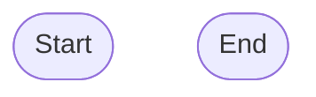
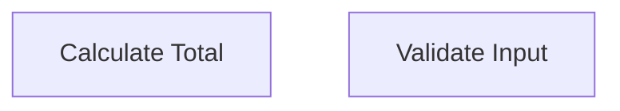
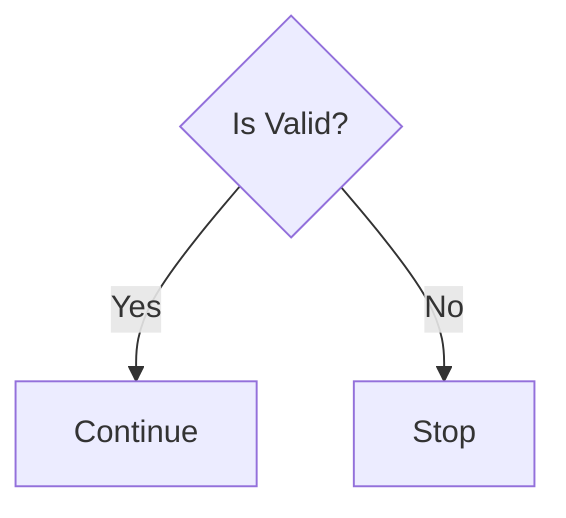
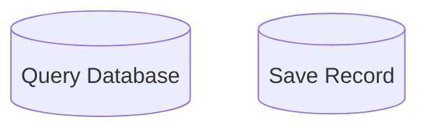
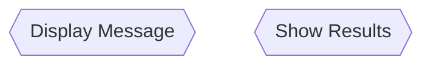
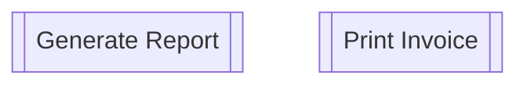
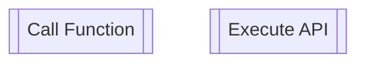
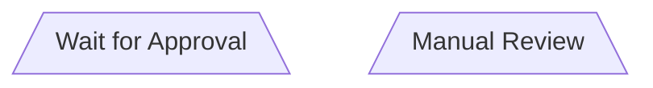
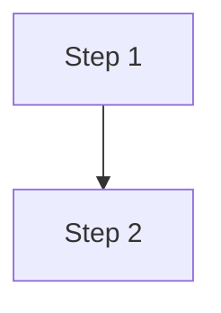
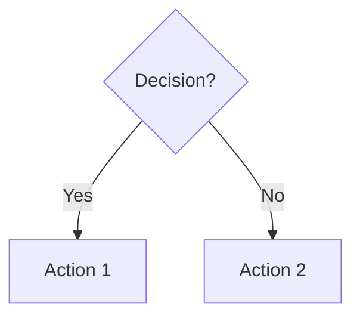

# ISO 5807 Standard Reference

## Overview

ISO 5807:1985 is the international standard for **Information processing - Documentation symbols and conventions for data, program and system flowcharts, program network charts and system resources charts**.

This document provides a reference for the ISO 5807 symbols implemented in this generator.

## Standard Flowchart Symbols

### 1. Terminator (Oval/Stadium)

**Shape**: Rounded rectangle or oval

**Use**: 
- Start points (beginning of process)
- End points (termination of process)
- External interrupts

**Examples**:
- "Start"
- "End"
- "Begin Process"
- "Stop"

**Implementation**:

---

### 2. Process (Rectangle)

**Shape**: Rectangle

**Use**:
- Any processing step
- Calculations
- Data transformations
- General operations

**Examples**:
- "Calculate total"
- "Validate input"
- "Transform data"
- "Update record"

**Implementation**:

---

### 3. Decision (Diamond)

**Shape**: Diamond

**Use**:
- Conditional branching
- Yes/No questions
- True/False evaluations
- Multiple choice paths

**Examples**:
- "Is user authenticated?"
- "Check if valid"
- "Data correct?"

**Requirements**:
- Must have at least 2 outgoing paths
- All paths must be labeled (Yes/No, True/False, etc.)

**Implementation**:

---

### 4. Input/Output (Parallelogram)

**Shape**: Parallelogram (slanted rectangle)

**Use**:
- Data input operations
- Data output operations
- Reading from sources
- Writing to destinations

**Examples**:
- "Read user input"
- "Output result"
- "Get data from file"
- "Send response"

**Implementation**:

---

### 5. Database (Cylinder)

**Shape**: Cylinder

**Use**:
- Database queries
- Database updates
- Data storage operations
- Persistent data access

**Examples**:
- "Query user database"
- "Insert record"
- "Update inventory"
- "Fetch from database"

**Implementation**:

---

### 6. Display (Hexagon)

**Shape**: Hexagon

**Use**:
- Screen output
- User interface display
- Visual presentation
- Message showing

**Examples**:
- "Display message"
- "Show results"
- "Render page"
- "Present data"

**Implementation**:

---

### 7. Document (Wavy Bottom Rectangle)

**Shape**: Rectangle with wavy bottom edge

**Use**:
- Document generation
- Report creation
- File output
- Printable documents

**Examples**:
- "Generate report"
- "Print invoice"
- "Export PDF"
- "Create document"

**Implementation**:

---

### 8. Predefined Process (Double-sided Rectangle)

**Shape**: Rectangle with double vertical sides

**Use**:
- Sub-routines
- Function calls
- Predefined operations
- Module invocation

**Examples**:
- "Call validation function"
- "Execute API request"
- "Run subroutine"
- "Invoke service"

**Implementation**:

---

### 9. Manual Operation (Trapezoid)

**Shape**: Trapezoid

**Use**:
- Manual intervention
- Human operations
- Wait states
- Approval processes

**Examples**:
- "Wait for approval"
- "Manual review"
- "User confirms"
- "Operator input"

**Implementation**:

---

### 10. Connector (Circle)

**Shape**: Small circle

**Use**:
- Off-page connectors
- Flow continuation
- Avoiding line crossings
- Complex flow simplification

**Examples**:
- "A" (connector label)
- "1" (connector number)

**Implementation**:

---

## Flow Lines

### Standard Flow

**Symbol**: Solid line with arrowhead

**Use**: Standard sequential flow between steps

### Conditional Flow

**Symbol**: Solid line with arrowhead and label

**Use**: Decision branch paths

## Best Practices

### 1. Flow Direction

- **Primary**: Top to bottom (TD)
- **Alternative**: Left to right (LR)
- **Avoid**: Bottom to top, Right to left (harder to read)

### 2. Single Entry/Exit

- ✅ One START node
- ✅ At least one END node
- ❌ No hanging paths
- ❌ No unreachable nodes

### 3. Decision Branches

- ✅ All branches labeled clearly
- ✅ Exactly 2-3 branches per decision
- ❌ Unlabeled branches
- ❌ More than 3 branches (consider multiple decisions)

### 4. Line Crossing

- ✅ Minimize line crossings
- ✅ Use connectors for complex flows
- ❌ Excessive crossing (confusing)

### 5. Label Clarity

- ✅ Concise labels (verb + object)
- ✅ Clear action description
- ✅ Consistent terminology
- ❌ Overly long text
- ❌ Ambiguous descriptions

### 6. Consistency

- ✅ Uniform symbol sizes
- ✅ Consistent spacing
- ✅ Standard orientation
- ❌ Varying symbol proportions
- ❌ Irregular layout

## Validation Rules

This generator enforces the following ISO 5807 compliance rules:

1. **Structure**
   - At least one START terminator
   - At least one END terminator
   - All nodes connected to flow

2. **Symbols**
   - Only valid ISO 5807 symbols used
   - Symbols used appropriately for operations

3. **Connections**
   - All connections reference valid nodes
   - No orphaned nodes
   - Flow continuity maintained

4. **Decisions**
   - Minimum 2 outgoing branches
   - All branches labeled
   - Maximum 3 branches (warning)

5. **Terminators**
   - START has no incoming connections
   - END has no outgoing connections
   - Single entry point

6. **Labels**
   - All nodes have labels
   - Labels are concise (<100 chars)
   - Clear and descriptive

## References

- ISO 5807:1985 - Information processing documentation symbols
- ANSI/ISO 5807 - Flowchart symbols and their usage
- IEEE Standard for Software Documentation

## Symbol Summary Table

| Symbol | Shape | Mermaid | Primary Use |
|--------|-------|---------|-------------|
| Terminator | Oval | `([text])` | Start/End |
| Process | Rectangle | `[text]` | Operations |
| Decision | Diamond | `{text}` | Branching |
| I/O | Parallelogram | `[/text/]` | Data I/O |
| Database | Cylinder | `[(text)]` | DB ops |
| Display | Hexagon | `{{text}}` | Screen |
| Document | Wavy rect | `[[text]]` | Reports |
| Predefined | Double rect | `[[text]]` | Functions |
| Manual | Trapezoid | `[/text\]` | Human ops |
| Connector | Circle | `((text))` | Flow links |
